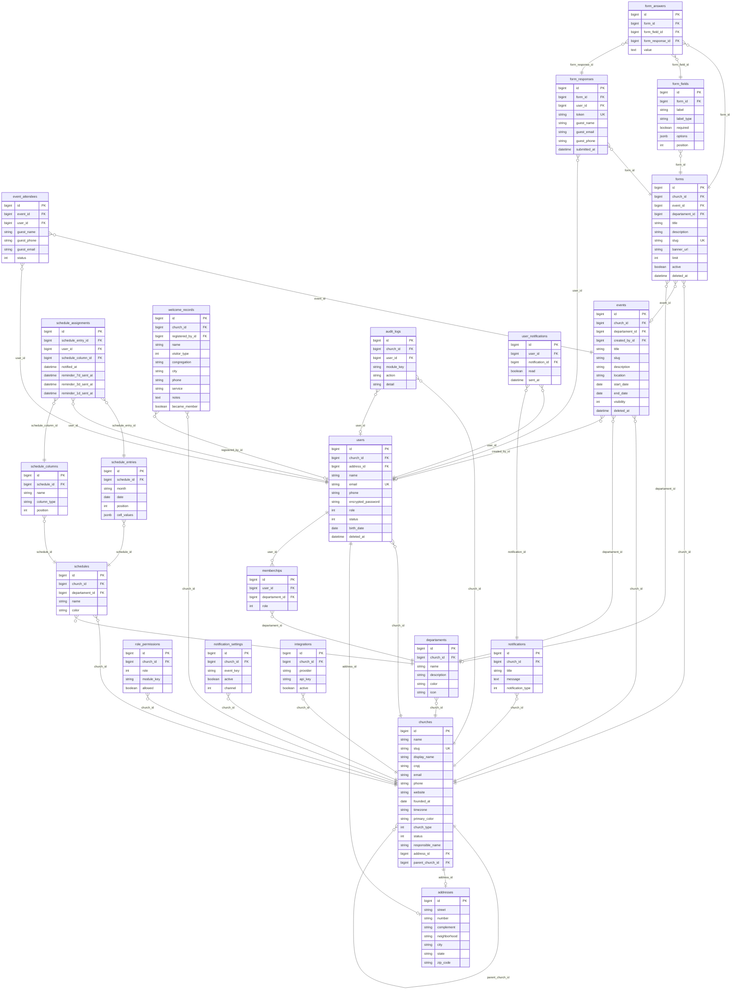
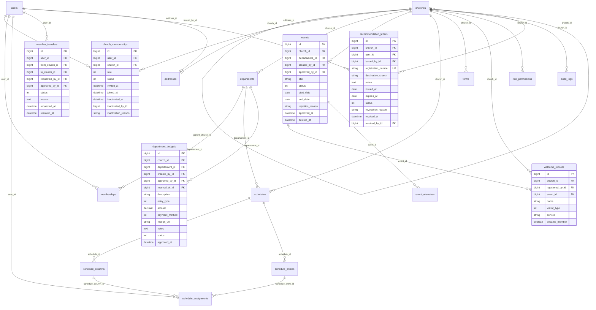

# Ekklesia — Arquitetura e Modelagem de Dados

> **Versão 1.0 · Julho 2026**
> Documento interno — uso restrito à equipe de engenharia

---

## Sumário

1. [Visão Geral da Arquitetura](#1-visão-geral-da-arquitetura)
2. [Decisões de Arquitetura](#2-decisões-de-arquitetura)
3. [Modelo Conceitual — Domínios](#3-modelo-conceitual--domínios)
4. [Diagrama ER Principal](#4-diagrama-er-principal)
5. [Modelo Físico — Tabelas Existentes](#5-modelo-físico--tabelas-existentes)
6. [Lacunas e Evoluções Necessárias](#6-lacunas-e-evoluções-necessárias)
7. [Diagrama ER — Estado Futuro](#7-diagrama-er--estado-futuro)
8. [Índices e Performance](#8-índices-e-performance)
9. [Regras Globais de Integridade](#9-regras-globais-de-integridade)
10. [Glossário Técnico](#10-glossário-técnico)

---

## 1. Visão Geral da Arquitetura

O Ekklesia é um SaaS multi-tenant para gestão de igrejas construído em **Ruby on Rails 8** com **PostgreSQL**, utilizando **Hotwire** (Turbo + Stimulus) no front-end e **Pundit** para autorização baseada em roles.

### Stack

| Camada | Tecnologia |
|---|---|
| Back-end | Ruby on Rails 8 |
| Banco de dados | PostgreSQL |
| Front-end | Hotwire (Turbo Streams + Stimulus) |
| Autorização | Pundit (policies por resource) |
| Autenticação | Devise |
| Background Jobs | Solid Queue (Rails 8 nativo) |
| Cache | Solid Cache (Rails 8 nativo) |

### Modelo de multi-tenancy

O isolamento entre tenants é feito pela coluna `church_id` presente em **todas as tabelas de domínio**. Cada registro pertence a uma `church` — que pode ser uma sede ou uma congregação filha. A hierarquia entre igrejas é resolvida pela coluna `parent_church_id` na própria tabela `churches`.

```
tenant (ministério contratante)
    └── church (sede) [parent_church_id: null]
            ├── church (congregação filha A) [parent_church_id: sede.id]
            └── church (congregação filha B) [parent_church_id: sede.id]
```

> **Decisão:** optou-se por `church_id` como chave de tenant em vez de um `tenant_id` separado, pois a sede **é** o tenant raiz. Queries que precisam de visão consolidada (sede vê filhas) usam `Church.where(parent_church_id: sede.id)` para montar o escopo.

---

## 2. Decisões de Arquitetura

### 2.1 Membro e Usuário como entidade única (`users`)

**Decisão atual:** membro e usuário são a mesma tabela. Todo membro tem uma entrada em `users`.

**Justificativa:** simplifica o modelo inicial — não há necessidade de JOIN entre `members` e `users` para carregar dados de acesso. Devise opera diretamente sobre `users`.

**Trade-off:** membros sem acesso ao sistema (role `membro`) ainda ocupam uma entrada em `users` com `encrypted_password` vazio e `status: inativo`. Isso é aceitável no escopo atual.

**Evolução futura:** se o volume de membros sem login crescer significativamente, criar tabela `members` separada e transformar `users` em apenas contas de acesso, com `belongs_to :member`.

---

### 2.2 Role por usuário (`users.role`) vs. role por church

**Decisão atual:** um usuário tem um único `role` global (`users.role`). O vínculo com departamento tem seu próprio `role` em `memberchips.role`.

**Trade-off:** um usuário não pode ter roles diferentes em churches diferentes com o schema atual. Ex: João não pode ser `admin` na sede e `membro` na filha simultaneamente.

**Evolução necessária:** criar tabela `church_memberships` (vínculo usuário ↔ church com role), permitindo roles por contexto de church. Detalhado na seção 6.

---

### 2.3 Soft delete com `deleted_at`

Tabelas que suportam remoção lógica usam `deleted_at` (padrão Paranoia/Discard):
- `users.deleted_at`
- `events.deleted_at`
- `forms.deleted_at`

Tabelas sem `deleted_at` usam `status` enum para inativação (ex: `users.status`, `churches.status`).

**Regra:** nenhum registro é excluído fisicamente. Toda remoção é lógica.

---

### 2.4 Permissões por role e módulo (`role_permissions`)

Em vez de permissões hardcodadas no código, o sistema usa a tabela `role_permissions` para armazenar quais roles têm acesso a quais módulos por church. Isso permite que o master configure permissões sem deploy.

```
role_permissions (church_id, role, module_key, allowed)
```

O Pundit consulta essa tabela via `RolePermission` model para decidir o acesso.

---

### 2.5 Escala genérica e flexível

O módulo de escalas foi modelado de forma genérica com 4 tabelas:

```
schedules (tipo de escala — ex: Mídia, Vocalistas)
    └── schedule_columns (colunas — ex: FOTOS, STORIES)
    └── schedule_entries (eventos/cultos do mês)
            └── schedule_assignments (membro atribuído a coluna + entrada)
```

Isso permite que qualquer departamento crie escalas com colunas personalizadas sem alteração de schema.

---

### 2.6 Endereços como tabela separada (`addresses`)

Endereços são normalizados em tabela própria e referenciados por FK tanto em `users` quanto em `churches`. Isso evita duplicação de campos de endereço e permite atualização centralizada.

---

### 2.7 Isolamento de tenant via concern `BaseEntity`

**Decisão atual:** o isolamento multi-tenant não depende apenas da coluna `church_id` existir na tabela — todo model de domínio inclui o concern `BaseEntity` (`app/models/concerns/base_entity.rb`):

```ruby
module BaseEntity
  extend ActiveSupport::Concern

  included do
    belongs_to :church
    validates :church_id, presence: true
  end
end
```

**Justificativa:** garante `belongs_to :church` + `validates :church_id, presence: true` de forma centralizada, para que nenhum registro de domínio seja persistido sem tenant mesmo que um `belongs_to` futuro seja escrito com `optional: true` por engano ou um form permita mass-assignment sem `church_id`.

**Modelos que incluem `BaseEntity` hoje:** `AuditLog`, `Departament`, `Event`, `Form`, `Integration`, `Notification`, `NotificationSetting`, `RolePermission`, `Schedule`, `User`, `WelcomeRecord`.

**Modelos que não incluem** (porque não têm `church_id` direto — herdam o tenant via associação): `EventAttendee`, `FormAnswer`, `FormField`, `FormResponse`, `Memberchip`, `ScheduleAssignment`, `ScheduleColumn`, `ScheduleEntry`, `UserNotification`.

**Regra de leitura (scopes de tenant):** todo filtro de tenant nas queries/policies deve passar pelo `policy_scope` do Pundit — usando `same_church?` (visão restrita à própria church) ou `within_hierarchy?`/`Church#accessible_church_ids` (visão hierárquica sede → filhas) definidos em `ApplicationPolicy`. Nunca filtrar por `church_id` hardcodado em controllers.

---

## 3. Modelo Conceitual — Domínios

O sistema é organizado em **7 domínios** funcionais:

```
┌─────────────────────────────────────────────────────────────┐
│                        EKKLESIA                             │
├──────────────┬──────────────┬──────────────┬────────────────┤
│  INSTITUIÇÃO │   PESSOAS    │   AGENDA     │   CONTEÚDO     │
│  churches    │  users       │  events      │  forms         │
│  addresses   │  memberchips │  schedules   │  form_fields   │
│              │              │  schedule_   │  form_responses│
│              │              │  entries     │  form_answers  │
│              │              │  schedule_   │                │
│              │              │  columns     │                │
│              │              │  schedule_   │                │
│              │              │  assignments │                │
├──────────────┴──────────────┴──────────────┴────────────────┤
│  FINANCEIRO  │  COMUNICAÇÃO │    ACESSO    │   ACOLHIMENTO  │
│  (futuro)    │ notifications│ role_perms   │ welcome_records│
│              │ user_notifs  │ audit_logs   │                │
│              │ notif_sets   │ integrations │                │
└──────────────┴──────────────┴──────────────┴────────────────┘
```

---

## 4. Diagrama ER Principal

> Estado atual do schema — tabelas existentes e seus relacionamentos.



---

## 5. Modelo Físico — Tabelas Existentes

### 5.1 `churches` — Instituições

Tabela central do multi-tenancy. Cada registro é uma sede ou congregação filha.

| Coluna | Tipo | Descrição |
|---|---|---|
| `id` | `bigint PK` | Identificador sequencial |
| `name` | `string NOT NULL` | Nome completo da instituição |
| `slug` | `string UNIQUE NOT NULL` | Identificador de URL |
| `display_name` | `string` | Nome exibido no header do sistema |
| `cnpj` | `string` | CNPJ da instituição |
| `email` | `string` | Email institucional |
| `phone` | `string` | Telefone |
| `website` | `string` | Site |
| `founded_at` | `date` | Data de fundação |
| `timezone` | `string DEFAULT "America/Fortaleza"` | Fuso horário |
| `primary_color` | `string DEFAULT "#4f6e5d"` | Cor primária do tema |
| `church_type` | `int DEFAULT 0` | `0: sede`, `1: congregacao`, `2: ponto_pregacao` |
| `status` | `int DEFAULT 0` | `0: ativa`, `1: inativa` |
| `responsible_name` | `string` | Nome do responsável |
| `address_id` | `bigint FK → addresses` | Endereço da instituição |
| `parent_church_id` | `bigint FK → churches` | Sede pai (null = é a sede raiz) |

---

### 5.2 `users` — Usuários / Membros

Entidade unificada de membro + usuário do sistema.

| Coluna | Tipo | Descrição |
|---|---|---|
| `id` | `bigint PK` | — |
| `church_id` | `bigint FK NOT NULL` | Congregação do usuário |
| `address_id` | `bigint FK` | Endereço residencial |
| `name` | `string NOT NULL` | Nome completo |
| `email` | `string UNIQUE NOT NULL` | Email (login Devise) |
| `phone` | `string` | Telefone |
| `encrypted_password` | `string NOT NULL` | Senha criptografada (Devise) |
| `role` | `int DEFAULT 2` | Role global do usuário (ver enum abaixo) |
| `status` | `int DEFAULT 0` | `0: ativo`, `1: inativo` |
| `birth_date` | `date` | Data de nascimento (base para aniversariantes) |
| `deleted_at` | `datetime` | Soft delete |

**Enum `role` — estado atual implementado (`app/models/user.rb`):**

| Valor | Role | Descrição |
|---|---|---|
| 0 | `admin` | Administrador / Pastor / Secretaria (papel único, acesso total) |
| 1 | `leader` | Líder de departamento |
| 2 | `member` | Membro (padrão) |

`RolePermission` (matriz de permissão por módulo) só configura os roles não-admin existentes hoje: `enum :role, { leader: 1, member: 2 }`.

> ⚠️ **Correção em relação à v1.0 anterior deste documento:** esta seção chegou a listar 9 valores (`admin, secretary, member, treasurer, leader, regente, reception, co_pastor, warehouse`) como se fossem o estado físico atual. Isso nunca existiu no código — era a visão-alvo dos perfis descritos em `context/ekklesia/perfis/` (`pastor.md`, `secretario.md`, `tesoureiro.md`, `recepcao.md`, `lider_departamento.md`). A expansão do enum para os novos perfis confirmados (`treasurer`, `reception`, `co_pastor`, `warehouse`) está planejada — ver seção 6.9.

> ⚠️ **Lacuna:** o role é único por usuário — não suporta roles diferentes por church. Ver seção 6.1.

---

### 5.3 `departaments` — Departamentos

> ⚠️ **Nota:** o nome da tabela contém typo — deveria ser `departments`. Corrigir em refactor futuro.

| Coluna | Tipo | Descrição |
|---|---|---|
| `id` | `bigint PK` | — |
| `church_id` | `bigint FK NOT NULL` | Congregação |
| `name` | `string NOT NULL` | Nome do departamento |
| `description` | `string` | Descrição |
| `color` | `string` | Classe CSS de cor (ex: `bg-blue-500 text-white`) |
| `icon` | `string` | Nome do ícone (ex: `users`) |

---

### 5.4 `memberchips` — Vínculo Usuário ↔ Departamento

> ⚠️ **Nota:** o nome da tabela contém typo — deveria ser `memberships`. Corrigir em refactor futuro.

| Coluna | Tipo | Descrição |
|---|---|---|
| `id` | `bigint PK` | — |
| `user_id` | `bigint FK NOT NULL` | Usuário |
| `departament_id` | `bigint FK NOT NULL` | Departamento |
| `role` | `int DEFAULT 0` | Role no departamento: `0: member`, `1: leader` |

**Constraint:** `UNIQUE (user_id, departament_id)` — um usuário só pode ter um role por departamento.

---

### 5.5 `events` — Eventos e Cultos

| Coluna | Tipo | Descrição |
|---|---|---|
| `id` | `bigint PK` | — |
| `church_id` | `bigint FK NOT NULL` | Congregação |
| `departament_id` | `bigint FK NOT NULL` | Departamento organizador |
| `created_by_id` | `bigint FK → users` | Quem criou |
| `title` | `string NOT NULL` | Título do evento |
| `slug` | `string` | URL amigável |
| `description` | `string` | Descrição |
| `thumbnail` | `string` | URL da imagem |
| `location` | `string` | Local |
| `start_date` | `date NOT NULL` | Data de início |
| `end_date` | `date NOT NULL` | Data de fim |
| `visibility` | `int DEFAULT 0` | `0: public`, `1: private`, `2: members_only` |
| `event_attendees_count` | `int` | Counter cache |
| `deleted_at` | `datetime` | Soft delete |

> ⚠️ **Lacuna:** sem campo `status` para fluxo de aprovação (`rascunho → aprovado`). Ver seção 6.2.

---

### 5.6 `schedules` + `schedule_columns` + `schedule_entries` + `schedule_assignments`

Módulo de escalas genéricas. Veja decisão de arquitetura 2.5.

**`schedules`** — tipo de escala (ex: Mídia, Vocalistas)

| Coluna | Tipo | Descrição |
|---|---|---|
| `church_id` | `bigint FK` | Congregação |
| `departament_id` | `bigint FK` | Departamento dono da escala |
| `name` | `string NOT NULL` | Nome da escala |
| `color` | `string NOT NULL` | Cor de destaque |

**`schedule_columns`** — colunas configuráveis (ex: FOTOS, STORIES)

| Coluna | Tipo | Descrição |
|---|---|---|
| `schedule_id` | `bigint FK` | Escala pai |
| `name` | `string NOT NULL` | Nome da coluna |
| `column_type` | `string DEFAULT "text"` | Tipo: `text`, `user`, `boolean` |
| `position` | `int NOT NULL` | Ordem de exibição |

**`schedule_entries`** — eventos/cultos da escala no mês

| Coluna | Tipo | Descrição |
|---|---|---|
| `schedule_id` | `bigint FK` | Escala pai |
| `month` | `string NOT NULL` | Mês de referência (ex: `"2026-06"`) |
| `date` | `date` | Data exata do culto/evento |
| `position` | `int` | Ordem na grade |
| `cell_values` | `jsonb DEFAULT {}` | Valores livres das células |

**`schedule_assignments`** — atribuições de membros às colunas

| Coluna | Tipo | Descrição |
|---|---|---|
| `schedule_entry_id` | `bigint FK` | Entrada da escala |
| `user_id` | `bigint FK` | Membro atribuído |
| `schedule_column_id` | `bigint FK` | Coluna da atribuição |
| `notified_at` | `datetime` | Quando foi notificado da escala |
| `reminder_7d_sent_at` | `datetime` | Lembrete enviado 7 dias antes |
| `reminder_3d_sent_at` | `datetime` | Lembrete enviado 3 dias antes |
| `reminder_1d_sent_at` | `datetime` | Lembrete enviado 1 dia antes |

**Constraint:** `UNIQUE (schedule_entry_id, user_id, schedule_column_id)`

---

### 5.7 `welcome_records` — Acolhimento

| Coluna | Tipo | Descrição |
|---|---|---|
| `church_id` | `bigint FK NOT NULL` | Congregação |
| `registered_by_id` | `bigint FK → users` | Quem registrou |
| `name` | `string NOT NULL` | Nome do visitante |
| `visitor_type` | `int NOT NULL` | `0: visitante`, `1: irmao` |
| `congregation` | `string` | Congregação de origem |
| `city` | `string` | Cidade |
| `phone` | `string` | Telefone/WhatsApp |
| `service` | `string NOT NULL` | Culto (string livre — ver lacuna 6.3) |
| `notes` | `text` | Observações / pedido de oração |
| `became_member` | `boolean DEFAULT false` | Se virou membro |

---

### 5.8 `role_permissions` — Permissões por Role e Módulo

| Coluna | Tipo | Descrição |
|---|---|---|
| `church_id` | `bigint FK NOT NULL` | Congregação |
| `role` | `int NOT NULL` | Role do usuário |
| `module_key` | `string NOT NULL` | Módulo do sistema (ex: `"members"`, `"schedules"`) |
| `allowed` | `boolean DEFAULT true` | Se o acesso está liberado |

**Constraint:** `UNIQUE (church_id, role, module_key)`

---

### 5.9 `audit_logs` — Auditoria

| Coluna | Tipo | Descrição |
|---|---|---|
| `church_id` | `bigint FK NOT NULL` | Congregação |
| `user_id` | `bigint FK` | Usuário que executou (null = sistema) |
| `module_key` | `string NOT NULL` | Módulo afetado |
| `action` | `string NOT NULL` | Ação executada (ex: `"created"`, `"inactivated"`) |
| `detail` | `string` | Descrição livre da ação |

---

### 5.10 Demais tabelas

| Tabela | Função |
|---|---|
| `addresses` | Endereços normalizados — usado por `users` e `churches` |
| `forms` + `form_fields` + `form_responses` + `form_answers` | Formulários dinâmicos com campos configuráveis |
| `event_attendees` | Inscrições em eventos (usuários ou convidados externos) |
| `notifications` + `user_notifications` | Sistema de notificações por usuário |
| `notification_settings` | Configuração de canais e eventos de notificação por church |
| `integrations` | Integrações externas (WhatsApp, SMTP) por church |

---

## 6. Lacunas e Evoluções Necessárias

### 6.1 🔴 `church_memberships` — Role por contexto de church

**Problema:** `users.role` é único e global. Um usuário não pode ter roles diferentes em churches diferentes.

**Solução:** criar tabela de vínculo `church_memberships`.

```ruby
# Migration
class CreateChurchMemberships < ActiveRecord::Migration[8.0]
  def change
    create_table :church_memberships do |t|
      t.references :user,   null: false, foreign_key: true
      t.references :church, null: false, foreign_key: true
      t.integer    :role,   null: false, default: 2
      t.integer    :status, null: false, default: 0
      t.datetime   :invited_at
      t.datetime   :joined_at
      t.datetime   :inactivated_at
      t.bigint     :inactivated_by_id
      t.string     :inactivation_reason
      t.timestamps
    end

    add_index :church_memberships, [:user_id, :church_id], unique: true
    add_foreign_key :church_memberships, :users,
                    column: :inactivated_by_id
  end
end
```

---

### 6.2 🔴 `events.status` — Fluxo de aprovação

**Problema:** não há como representar o fluxo `rascunho → aguardando_aprovacao → aprovado / recusado`.

**Solução:** adicionar colunas à tabela `events`.

```ruby
class AddStatusToEvents < ActiveRecord::Migration[8.0]
  def change
    add_column :events, :status, :integer, default: 0, null: false
    add_column :events, :approved_by_id, :bigint
    add_column :events, :approved_at, :datetime
    add_column :events, :rejection_reason, :string

    add_foreign_key :events, :users, column: :approved_by_id
    add_index :events, :status
  end
end

# Enum no model Event:
# enum :status, { draft: 0, pending_approval: 1, approved: 2, rejected: 3 }
```

---

### 6.3 🔴 `welcome_records.event_id` — Vínculo com culto real

**Problema:** `service` é uma string livre — não referencia a tabela `events`. Impossibilita relatórios cruzados entre acolhimento e cultos.

**Solução:** adicionar FK opcional para `events`.

```ruby
class AddEventIdToWelcomeRecords < ActiveRecord::Migration[8.0]
  def change
    add_reference :welcome_records, :event, foreign_key: true, null: true
    # Manter service como fallback para cultos não cadastrados no sistema
  end
end
```

---

### 6.4 🟡 Campos eclesiásticos em `users`

**Problema:** dados importantes para gestão pastoral estão ausentes.

```ruby
class AddEcclesiasticalFieldsToUsers < ActiveRecord::Migration[8.0]
  def change
    add_column :users, :gender,              :integer  # enum: masculino, feminino
    add_column :users, :marital_status,      :integer  # enum: solteiro, casado, divorciado, viuvo
    add_column :users, :baptized,            :boolean, default: false, null: false
    add_column :users, :baptism_date,        :date
    add_column :users, :joined_at,           :date     # data de ingresso na congregação
    add_column :users, :position,            :string   # cargo: diácono, presbítero, etc.
    add_column :users, :origin_church,       :string   # congregação de origem (transferência)
    add_column :users, :presented,           :boolean, default: false, null: false
    add_column :users, :presented_at,        :date
    add_column :users, :pastoral_notes,      :text     # visível apenas para admin/secretário
    add_column :users, :inactivation_reason, :string
    add_column :users, :inactivated_by_id,   :bigint
    add_column :users, :inactivated_at,      :datetime

    add_foreign_key :users, :users, column: :inactivated_by_id
    add_index :users, :baptized
    add_index :users, :joined_at
  end
end
```

---

### 6.5 🟡 `member_transfers` — Transferência entre congregações

```ruby
class CreateMemberTransfers < ActiveRecord::Migration[8.0]
  def change
    create_table :member_transfers do |t|
      t.references :user,              null: false, foreign_key: true
      t.references :from_church,       null: false,
                   foreign_key: { to_table: :churches }
      t.references :to_church,         null: false,
                   foreign_key: { to_table: :churches }
      t.references :requested_by,      null: false,
                   foreign_key: { to_table: :users }
      t.bigint     :approved_by_id
      t.integer    :status,            null: false, default: 0
      t.text       :reason
      t.datetime   :requested_at,      null: false
      t.datetime   :resolved_at
      t.timestamps
    end

    add_foreign_key :member_transfers, :users, column: :approved_by_id
    add_index :member_transfers, :status

    # enum :status, { pending: 0, approved: 1, rejected: 2, completed: 3 }
  end
end
```

---

### 6.6 🟡 `recommendation_letters` — Carta de Recomendação

```ruby
class CreateRecommendationLetters < ActiveRecord::Migration[8.0]
  def change
    create_table :recommendation_letters do |t|
      t.references :church,       null: false, foreign_key: true
      t.references :user,         null: false, foreign_key: true
      t.references :issued_by,    null: false,
                   foreign_key: { to_table: :users }
      t.string     :registration_number, null: false
      t.string     :destination_church
      t.text       :notes
      t.date       :issued_at,    null: false
      t.date       :expires_at,   null: false
      t.integer    :status,       null: false, default: 0
      t.string     :revocation_reason
      t.datetime   :revoked_at
      t.bigint     :revoked_by_id
      t.timestamps
    end

    add_index :recommendation_letters, :registration_number, unique: true
    add_index :recommendation_letters, :expires_at
    add_index :recommendation_letters, :status
    add_foreign_key :recommendation_letters, :users, column: :revoked_by_id

    # enum :status, { active: 0, expired: 1, revoked: 2 }
  end
end
```

---

### 6.7 🟡 `department_budgets` — Caixa de Departamento

```ruby
class CreateDepartmentBudgets < ActiveRecord::Migration[8.0]
  def change
    create_table :department_budgets do |t|
      t.references :church,       null: false, foreign_key: true
      t.references :departament,  null: false, foreign_key: true
      t.string     :description,  null: false
      t.integer    :entry_type,   null: false  # 0: income, 1: expense, 2: reversal
      t.decimal    :amount,       null: false, precision: 10, scale: 2
      t.integer    :payment_method, null: false, default: 0
      t.string     :receipt_url
      t.text       :notes
      t.integer    :status,       null: false, default: 0
      t.bigint     :approved_by_id
      t.datetime   :approved_at
      t.bigint     :reversal_of_id
      t.references :created_by,   null: false,
                   foreign_key: { to_table: :users }
      t.timestamps
    end

    add_foreign_key :department_budgets, :users,   column: :approved_by_id
    add_foreign_key :department_budgets, :department_budgets,
                    column: :reversal_of_id
    add_index :department_budgets, :status
    add_index :department_budgets, :entry_type

    # enum :entry_type,     { income: 0, expense: 1, reversal: 2 }
    # enum :payment_method, { cash: 0, pix: 1, transfer: 2, check: 3 }
    # enum :status,         { posted: 0, pending_approval: 1, approved: 2, reversed: 3 }
  end
end
```

---

### 6.8 🟢 Typos nos nomes de tabelas

Dois nomes de tabela contêm typos que devem ser corrigidos em refactor planejado:

| Atual | Correto | Impacto |
|---|---|---|
| `departaments` | `departments` | Alto — afeta models, controllers, helpers, i18n, specs |
| `memberchips` | `memberships` | Alto — mesmos impactos |

> ⚠️ Renomear tabelas em produção requer migration com `rename_table` + atualização de todas as FKs + atualização de todos os model names + atualização de índices. Planejar para uma sprint dedicada de refactor.

---

### 6.9 🔴 Expansão do enum `role` — novos perfis (Tesoureiro, Recepção, Co-Pastor, Almoxarifado)

**Problema:** `users.role` hoje só suporta `admin`, `leader`, `member` (seção 5.2). Os perfis descritos em `context/ekklesia/perfis/tesoureiro.md`, `recepcao.md` e `pastor.md` (seção 3, Co-Pastor) pressupõem roles próprios, com telas e permissões dedicadas.

**Confirmado:** os próximos perfis a entrar são `treasurer` (Tesoureiro), `reception` (Recepção), `co_pastor` (Co-Pastor) e `warehouse` (Almoxarifado).

**Solução:** como `admin`, `leader` e `member` já têm dados em produção nos valores `0`, `1`, `2`, os novos valores devem ser **anexados ao final** — nunca reordenar/reaproveitar os valores `0..8` da tabela antiga desta seção (v1.0), que nunca existiu no código.

```ruby
# Model User — apenas altera o enum, sem migration de coluna (role já é integer):
# enum :role, { admin: 0, leader: 1, member: 2, treasurer: 3, reception: 4, co_pastor: 5, warehouse: 6 }
```

**Dependências a revisar quando os roles forem adicionados:**
- `RolePermission` (`enum :role, { leader: 1, member: 2 }`) precisa incluir os novos valores para que a matriz de permissão por módulo (Configurações → Perfis e Permissões) cubra os novos perfis.
- `ApplicationPolicy#admin?`/`#leader?` e os métodos `manage?`/`module_allowed?` em `ChurchModulePolicy` assumem hoje só 3 roles — revisar caso os novos perfis tenham regras de acesso próprias (ex: Co-Pastor com acesso limitado por padrão, delegado pelo Pastor/Admin, conforme `pastor.md` seção 3).
- Não há ainda perfil documentado em `context/ekklesia/perfis/` para `secretary` (hoje coberto pelo próprio `admin`, rotulado "Secretaria" em `User#role_label`) nem para `regente` — não fazem parte deste ciclo; confirmar se ainda são necessários antes de adicionar.

---

### 6.10 🟡 Compartilhamento de escala e evento (Sede → Filhas)

**Problema:** a seção 5 do `arquitetura.md` (e a exceção descrita para Eventos/Cultos) define que o secretário/administrador da sede pode compartilhar uma escala — ou marcar um evento como compartilhado — com congregações filhas específicas, que passam a visualizar (somente leitura) o registro. Hoje não há nenhum suporte a isso: `schedules` e `events` não têm coluna de compartilhamento, e `SchedulePolicy`/`EventPolicy`/`ScheduleQuery`/`EventQuery` escopam estritamente por `church_id` próprio (sem hierarquia).

**Status:** funcionalidade futura, ainda não priorizada — compartilhamento de escala entra primeiro; compartilhamento de evento segue o mesmo padrão quando for a vez.

**Esboço de solução (a refinar quando entrar em prioridade):** tabela de junção many-to-many, para não forçar uma coluna booleana global em `schedules`/`events` e permitir compartilhar com filhas específicas (não todas):

```ruby
class CreateScheduleShares < ActiveRecord::Migration[8.0]
  def change
    create_table :schedule_shares do |t|
      t.references :schedule, null: false, foreign_key: true
      t.references :church,   null: false, foreign_key: true # congregação filha destinatária
      t.timestamps
    end

    add_index :schedule_shares, [:schedule_id, :church_id], unique: true
  end
end
```

Leitura (somente leitura) na filha: `Schedule.where(id: ScheduleShare.where(church: current_church).select(:schedule_id))`, sempre validando que `church.parent_church_id == schedule.church_id` no momento do compartilhamento (o secretário da sede só pode compartilhar com as próprias filhas).

---

## 7. Diagrama ER — Estado Futuro

> Inclui tabelas existentes + evoluções necessárias da seção 6.



---

## 8. Índices e Performance

### Índices existentes relevantes

| Tabela | Índice | Justificativa |
|---|---|---|
| `churches` | `slug (unique)` | Lookup por URL |
| `users` | `email (unique)` | Login Devise |
| `users` | `church_id` | Filtro de tenant |
| `users` | `EXTRACT(month, day) FROM birth_date` | Query de aniversariantes |
| `audit_logs` | `(church_id, created_at)` | Listagem paginada por tenant |
| `schedule_assignments` | `(entry_id, user_id, column_id) unique` | Evitar duplicidade |
| `welcome_records` | `(church_id, created_at)` | Listagem do dia por tenant |
| `forms` | `slug (unique)` | Lookup público de formulário |

### Índices recomendados a adicionar

| Tabela | Índice | Justificativa |
|---|---|---|
| `events` | `status` | Filtro de aprovação |
| `events` | `(church_id, start_date)` | Calendário mensal |
| `users` | `(church_id, status)` | Listagem de membros ativos |
| `users` | `baptized` | Métrica do dashboard |
| `member_transfers` | `status` | Pendências do secretário |
| `recommendation_letters` | `expires_at` | Alerta de vencimento |
| `department_budgets` | `(departament_id, status)` | Extrato por departamento |

---

## 9. Regras Globais de Integridade

Estas regras se aplicam a **todo o sistema** e devem ser garantidas tanto na camada de aplicação (model validations) quanto na camada de banco (constraints e FKs):

| Regra | Onde garantir |
|---|---|
| Todo registro de domínio tem `church_id` | Model validation + FK + índice |
| Nenhum registro é excluído fisicamente | `deleted_at` ou `status: inativo` — nunca `DELETE` SQL |
| `church_id` e contexto de tenant nunca são editáveis pelo usuário | Strong params — nunca permitem `church_id` como param |
| Toda ação relevante gera entrada em `audit_logs` | Callbacks no model ou concern `Auditable` |
| Enums são sempre `integer` no banco | Padrão Rails — nunca `string enum` |
| Valores monetários usam `decimal (10, 2)` | Nunca `float` para dinheiro |
| Datas futuras são validadas no model | `validate: data_x_nao_pode_ser_futura` |
| Self-approval bloqueado | Policy Pundit — `record.created_by_id != user.id` |

---

## 10. Glossário Técnico

| Termo | Definição |
|---|---|
| **Tenant** | No Ekklesia, cada `church` (sede ou filha) é um tenant. O isolamento é por `church_id`. |
| **Sede** | `church` com `parent_church_id: null`. É a raiz do ministério. |
| **Congregação filha** | `church` com `parent_church_id` preenchido. |
| **Soft delete** | Remoção lógica via `deleted_at` — registro permanece no banco. |
| **Enum** | Coluna `integer` no banco mapeada para símbolos no Rails via `enum :coluna, {}`. |
| **Counter cache** | Coluna `_count` mantida pelo Rails para evitar `COUNT(*)` a cada query. |
| **Scope de tenant** | `where(church_id: user.church_id)` aplicado em toda query de domínio. |
| **Pundit** | Gem de autorização — cada resource tem uma `Policy` com métodos como `create?`, `update?`. |
| **Devise** | Gem de autenticação — opera sobre a tabela `users`. |
| **Solid Queue** | Background jobs nativo do Rails 8 — usado para lembretes, notificações e exports. |
| **Turbo Stream** | Parte do Hotwire — atualiza partes da página sem reload via WebSocket ou SSE. |
| **JSONB** | Tipo PostgreSQL para JSON binário — usado em `schedule_entries.cell_values` e `form_fields.options`. |

---

*Ekklesia — Documento interno · Versão 1.0 · Julho 2026*